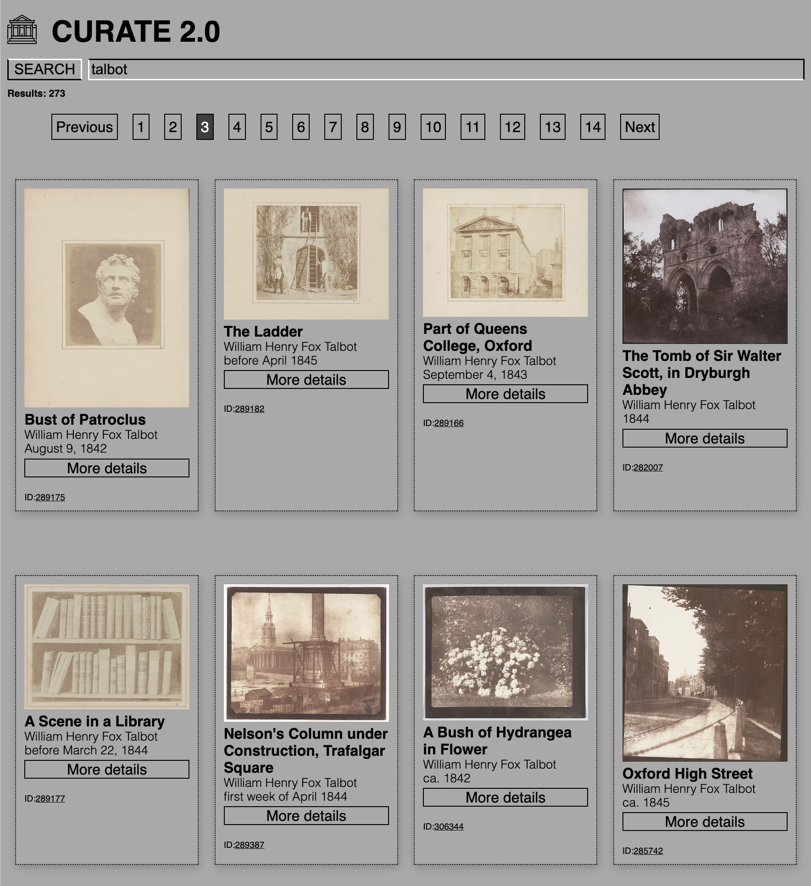

# Curate 2.0
Introducing a simplified tool for art and culture aficionados: the Metropolitan Museum of Art (MET) Search.

With its easy-to-use interface and extensive database of the MET's collection, this application allows you to search for any artwork in the museum's collection, from ancient artifacts to contemporary masterpieces.

Simply type in your desired search term and in seconds, Curate will deliver a wide range of results, complete with high-quality images, titles, artist names, dates, and additional details about each piece.

Whether you're a student, a scholar, or just someone who loves art, this application is an invaluable tool for exploring the vast and diverse collection of the MET. Discover new favorites, learn about different periods and styles, and deepen your appreciation for the beauty and complexity of the visual arts.

Demo: 
[Curate 2.0](https://6434570ae8aa707309c595cd--bright-melba-b2dbbb.netlify.app/)

## Technologies
Curate is built with Vite & React, with custom logic and styling.

Curate uses the MET Open Access API: https://www.metmuseum.org/about-the-met/policies-and-documents/open-access

